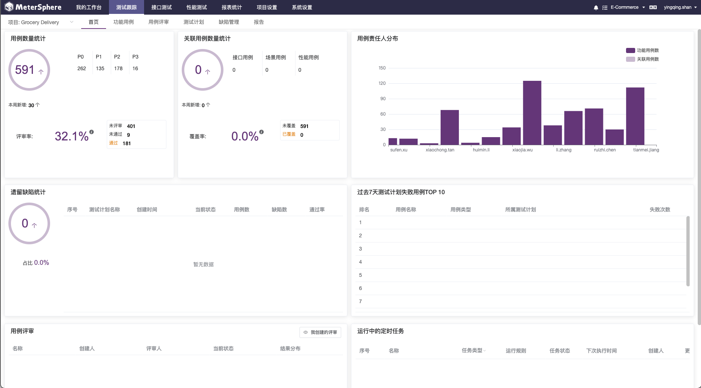
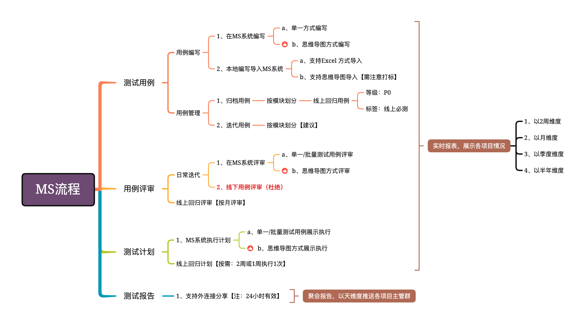

## 项目介绍

MeterSphere 是一站式开源持续测试平台, 涵盖测试跟踪、接口测试、UI 测试和性能测试等功能，全面兼容 JMeter、Selenium 等主流开源标准，有效助力开发和测试团队充分利用云弹性进行高度可扩展的自动化测试。

!!! error "注意"
    
    1、目前公司使用的MeterSphere 系统非企业版本，企业版本功能不可使用

## 界面展示

## 在用功能

- **测试跟踪**: 对接主流项目管理平台，测试过程全链路跟踪管理； 列表脑图模式自由切换，用例编写更简单、测试报告更清晰；
- **接口测试**: 比 JMeter 易用，比 PostMan 强大； API 管理、Mock 服务、场景编排、多协议支持，你想要的全都有；

## 使用规范与流程

## 支持团队

1. 文档维护人
    - 佘素琴(suqin.she@sayweee.com)
    - 徐素芬(sufen.xu@sayweee.com)
2. 技术支持：
    - 单应青(yingqing.shan@sayweee.com)
    - 陈佳玲(jialing.chen@sayweee.com)
   
  